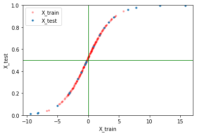

~~~~~~~~~~~~~~~~~~~~~~~~~~~~~~~~~~~~~~~~~~~~~~~~~~~~~~~~~~~~~~~~~~~~~~~~~~~~~~~~~~~~~~~~~
How to build customized sklearn transformers using sigmoid transformation as an example
~~~~~~~~~~~~~~~~~~~~~~~~~~~~~~~~~~~~~~~~~~~~~~~~~~~~~~~~~~~~~~~~~~~~~~~~~~~~~~~~~~~~~~~~~

We will

1. Take a look at the base classes

2. Build a Sigmoid transformer

3. Demonstrate this transformer as part of pipeline and do hyperparameter tuning

4. Make a transformer combiner on dataframe