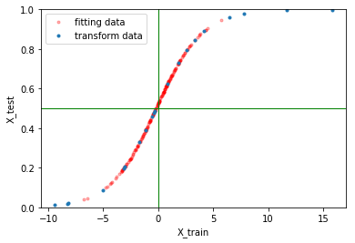

------------------------------------------------
How to build your own sklearn transformer
------------------------------------------------

The goal is to demostrate how to implement a sklearn transformer class, and your own Pipeline and FeatureUnion class to combine multiple transformers.

Understand the base class
==========================
   
sklearn has the base classes ``BaseEstimator`` and ``TransformerMixin`` for this purpose. ``BaseEstimator`` provides two methods ``get_params()`` and ``set_params()``. They are used to do hyperparameter optimization. Take a look at the methods first.

.. code-block:: python

    @classmethod
    def _get_param_names(cls):
        init = getattr(cls.__init__, 'deprecated_original', cls.__init__)
        if init is object.__init__:
            return []
        
        init_signature = signature(init)
        parameters = [p for p in init_signature.parameters.values()
                        if p.name != 'self' and p.kind != p.VAR_KEYWORD]

        ## and more things
        ## and more things

    def get_params(self, deep=True):
        out = dict()
        for key in self._get_param_names():
            value = getattr(self, key, None)
            if deep and hasattr(value, 'get_params'):
                deep_items = value.get_params().items()
                out.update((key + '__' + k, val) for k, val in deep_items)
            out[key] = value 
        return out 

There are few things to mention about the above code: 

1. ``get_params()`` calls a hidden class method ``_get_param_names()`` to retrieve the keyword parameters **explicitly** defined on class ``__init__`` method. *\*\*kwargs* is invalid. The ``signature()`` function in ``.utils.fixes`` module is a wrapper to present uniform interface for different versions of Python. For version 3.3 up it calls ``inspect.getargspec`` method and for Python 3.3 and lower it calls ``funcsigs.signature`` method to retrieve the ``cls.__init__`` signature in sklearn version 0.18. In 0.16 only ``inspect.getargspec`` was used (it is getting depcrecated in Python 3.6). To define a transformer with hyperparameters, we need to explicitly define those hyperparameter as keyward arguments in the ``__init__`` method.  

2. ``get_params(deep=True)`` has deep flag default to ``True``. It recursively search down parameters that are also BaseEstimators, until reaching the level with flag set to ``False`` or to the level of ``object``.

3. When it retrieves deep parameters, double underscore '__' is used to for the namespace for deep parameters. ``set_prams()`` method uses the same rule to parse the parameter names to set the values recursively.

4. Worth paying attention that ``setattr`` calls ``self.__setattr__`` to set attributes. So do not mess up with ``__setattr__``, especially not to call ``setattr`` in ``self.__setattr__``.

5. We do not have to do anything with these methods. 

Now let's take a look at ``TransformerMixin`` 

.. code-block:: python

    class TransformerMixin(object):
        def fit_transform(self, X, y=None, **fit_parameters):
            '''
            Parameters
            ----------
            X : numpy array of shape [n_samples, n_features]
                Training set.
            y : numpy array of shape [n_samples]
                Target values.
            '''
            if y is None:
                return self.fit(X, **fit_parameters).transform(X)
            else:
                return self.fit(X, y, **fit_parameters).transform(X)

A few things to notice

1. ``fit()`` and ``transform()`` were not defined as ``abstract`` methods, but implicitly it requires the implementation of these methods.

2. The ``y`` numpy array shape instruction is not always very accurate here. Better and safer to always have 2D ``y``, using ``y.reshape(-1,1)``.

3. ``y`` is **required**. Even you can override ``fit_transform`` not to take ``y``, other methods may assume there is a ``y`` parameter at its position. To be compatable with the system, set ``y=None``.

4. Notice there are some ``fit`` methods has ``y`` as parameter, while others not. Legacy issues. 

Build a ``sigmoid`` transformer
=================================

Let's build a transformer that normalizes data using a *logistic* function. As preprocessing, normalization brings much benefit such as unified inputs, data bias and variation removal, high computational efficiency and search time, more robust optimization and less numerical error, *et.*.  As an alternative to ``minmax``, ``standardization`` and other normalization methods, ``sigmoid`` function combines linear and non-linear transformation. It maintains good linearity for majority of the data close to center. And for extreme values (outliers) it reduces the the values exponentially and keeps the sample ordinal information. 

We will also set two parameters ``bias`` and ``scale`` as a population correction mechanism in case there is a populaton shift. 

Note if the parameter list is too long (or you being too lazy), you can use the ``inspect.signature`` to automate initialization. It probably is an overkill here.

.. code-block:: python

    from sklearn.base import BaseEstimator, TransformerMixin
    import inspect 
    import numpy as np 
    import matplotlib.pyplot as plt 

    def sigmo(m, sig):
        def f(x):
            return 1.0/(1.0 + np.exp(-(x-m)/sig))
        return f 

    class Sig_trans(BaseEstimator, TransformerMixin):
        def __init__(self, bias=0, scale=1.0):
            ## this is an over kill for these two parameters, we can just do
            # self.bias = bias
            # self.scale = scale
            z = [p.name for p in inspect.signature(self.__init__).parameters.values()]
            l = locals()
            for k in z:
                setattr(self, k, l[k])

        def _fit(self, X, y=None):
            self.mean = X.mean()
            self.std = X.std()
            self.sigmoid = sigmo(self.mean, self.std)

        def fit(self, X, y=None):
            self._fit(X)
            return self 

        def transform(self, X):
            if not hasattr(self, 'sigmoid'):
                raise AttributeError('Fit the transformer first')
            return self.sigmoid(X)

    if __name__ == '__main__':
        X_train =  np.random.normal(0, 2.0, (200, 1))
        X_test = np.random.normal(0, 5.0, (20, 1))

        T = Sig_trans()
        X_train_p = T.fit_transform(X_train)
        X_test_p = T.transform(X_test)

        fig = plt.figure()
        plt.plot(x, xp, 'r.', label='fitting data', alpha=0.3)
        plt.plot(y, yp, '.', label='transform data')

        plt.legend()
        plt.xlabel('X_train')
        plt.ylabel('X_test')
        plt.ylim(0,1)
        xlim = plt.xlim()
        plt.plot(xlim, [0.5, 0.5], '-g', linewidth=1)
        plt.plot([0,0],[0,1], '-g', linewidth=1)
        plt.xlim(xlim)
        plt.show()  

As the result, this is what we should see.

Notice for extremely high values in ``X_test`` the output are close to 1. However there are still difference to keep the ordinal information here. No saturation is introduced.

Use the logistic transformer in Pipeline and hyperparameter optimization
=========================================================================

A combo transformer example
=========================================================================

        

